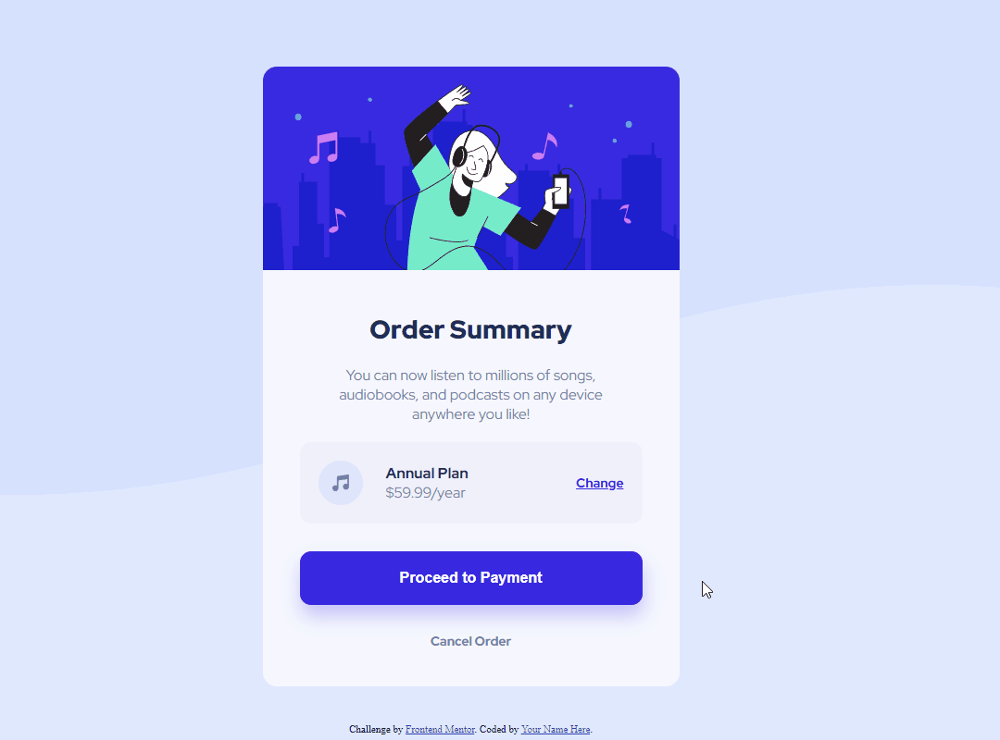

# Frontend Mentor - Order summary card solution

This is a solution to the [Order summary card challenge on Frontend Mentor](https://www.frontendmentor.io/challenges/order-summary-component-QlPmajDUj). Frontend Mentor challenges help you improve your coding skills by building realistic projects. 

## Overview

This is a Order summary card of a musical app (like spotify), this is the page that order a plan of services.

### The challenge

Users should be able to:

- See hover states for interactive elements

## Screenshots

Here some gifs about my resolution:

- ### Desktop

- ### Mobile

### Links

- Solution URL: [FrontEnd Mentor](https://www.frontendmentor.io/solutions/-html5-e-css-8-newbie-order-summary-RV0Z4dKV4X)
- Live Site URL: [Live Site](https://ramon-alvez.github.io/Frontend-Mentor-HTML-CSS-Newbie-Order-Sumary/)

## My process

### Built with

- Semantic HTML5 markup
- CSS custom properties
- Flexbox

### Continued development

I intend to continue doing the frontend mentor challenges until I finish them all, and learning with the process ;D.

## Author

- GitHub - [Ramon Alvez](https://github.com/Ramon-Alvez)
- Frontend Mentor - [@Ramon Alvez](https://www.frontendmentor.io/profile/Ramon-Alvez)
- LinkedIn - [@Ramon Alvez](https://www.linkedin.com/in/ramon-alvez/)
